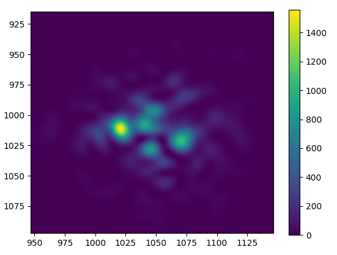

# Propgation Simulator Repo #

This repo is a sandbox for an ___Atmospheric Turbulence Simulation___ tool. 

The Python code was adapted from the MATLAB work done in this textbook [Numerical Simulation of Optical Wave Propagation with Examples in MATLAB](documents\Reference-Material\Textbooks\Numerical-Simulation-of-Optical-Wave-Propagation-with-Examples-in-MATLAB). Most functions can be found with the same name as in the textbook for further reading and explanation.

The [MATLAB Textbook](documents\Reference-Material\Textbooks\Numerical-Simulation-of-Optical-Wave-Propagation-with-Examples-in-MATLAB) is a fantastic resource to read more about wave propagation techniques and atmoshperic turbulence models.


## Setup ##
 - create a python venv:
    ```
    > cd <desired directory for virtual env location>
    > python -m venv <name of venv>
    > <name of venv>\Scripts\activate.bat
    ```
 - Execute:
    ```
    > cd <repository directory>
    > pip install -r 'requirements.txt'
    ```
 - Install CUDA (GPU support for Tensorflow) - [instructions](https://tensorflow-object-detection-api-tutorial.readthedocs.io/en/latest/install.html#gpu-support-optional)


## Execution ##

As scripts are mostly sandboxed/testing simulator modules, execution is as easy as running any of the `./src/*.py` scripts. Ex: 
```
 > python ./src/gaussian_beam_test.py   
```

## Architechure ##

### Block Diagram: ###


### Block Details: ###


## Pythonic Details ##

As mentioned, most functions were adapted from MATLAB to work in Python. This was mostly due to my familiarity with Python, as well as it's strong library support (ie: Matplotlib, Numpy, Tensorflow, etc).

Python classes are used to easily encapuslate some of the blocks shown above, like the Phase Screen Generator.

### GPU acceleration with Tensorflow: ###

Tensorflow was used to enable GPU access and execute computationally expensive code very quickly. Speed performance between CPU and GPU execution saw results of 100x or more. The only issue was found to be limited VRAM (5GB) which, if not careful, can be quickly consumed by high resolution phase screens.

There are 2 main execution flows within Tensorflow - Eager or Graph execution. Eager execution, often the default for Tensorflow 2.0 will execute Python code, operation by operation, and return the results. This is often still fast, but limits the speed ceiling. This project mainly uses eager execution of Tensorflow. The Graph execution approach proved to be more difficult to implement, more information can be found [here](https://www.tensorflow.org/guide/intro_to_graphs).


## Example Output (WIP: Description/Labelling needed) ##

<span>


</span>

_Figure 1:_ Shows the execution of the `phase_screen_gen()` function found in [phase_screen_test.py](src\phase_screen_test.py). The left-most plot is the Fourier Transform method output - mostly high spatial-frequency. The middle plot is the Subharmonic Method - mostly low spatial-frequency. The last plot is the sum of the first two plots - yielding a more statistcally accurate phase screen.


_Figure 2:_ Shows the execution of the `phase_screen_statistics()` function found in [phase_screen_test.py](src\phase_screen_test.py). It displays the statistical accuracy of the Fourier Transform Method, and the Subharmonic Method, with theory.


_Figure 3:_ Demonstrates the `frozen_flow_phase_screen_TEST()` function found in [frozen_flow_test.py](src\frozen_flow_test.py). A rectangular phase screen is created, and shifted pixel by pixel, to simulate the Taylor's Frozen Flow Model approach to the temporal behaviour of turbulence.

<span>


</span>

_Figure 4:_ Shows the output of `turb_prop_to_focus()` function found in [Turbulence_Sim_examples.py](src/Turbulence_Sim_examples.py) with low turbulence (r0 ~ D), and mild turbulence (r0 ~ 1/3 D). Take note of the blurriness, beam wandering, and multi-speckle pattern.


_Figure 5:_ This shows the output of `turb_prop_to_focus_animation()` function found in [Turbulence_Sim_examples.py](src/Turbulence_Sim_examples.py). Using Taylor's Frozen Flow Model, the phase screens were shifted after each full propagation to the pupil plane. The resulting image is saved and stored to be animated later.

__Note:__ The animation is saved in the [saved_data/](saved_data/) folder, and can be played back later using the [load_animation.py](src/load_animation.py) script.


## Reading, References, and Learning ##
The [documents/](documents/) folder contains lots of information regarding [reading lists](documents\Reference-Material\ReadingList.pdf), [papers](documents\Reference-Material\Papers), [presentations](documents\Presentations), that will prove useful for learning about Atmospheric Turbulence, Phase Screens, MATLAB/Python, etc.

The specific goals for this project are outlined in the [Project Goals](documents\Reference-Material\ProjectGoals.pdf).

Special focus should be given to the [MATLAB Textbook](documents\Reference-Material\Textbooks\Numerical-Simulation-of-Optical-Wave-Propagation-with-Examples-in-MATLAB) specifically, as most of the content from this project was adapted from that book.


## TODOs ##
 - Channel Layer Slicer module (used to calculate optimal r0 values along the propagation path). More details can be found in Ch. 9.5 (& Listing 9.5) in the mentioned [MATLAB textbook](documents\Reference-Material\Textbooks\Numerical-Simulation-of-Optical-Wave-Propagation-with-Examples-in-MATLAB).
 - Graph execution of Tensorflow functions (performance increase). Information [here](https://www.tensorflow.org/guide/intro_to_graphs).
 - Further parallelization (execute multiple end-to-end propagations at once). This may be limited by the GPU VRAM. Optimizations may need to implemented in the storage of phase screens - ie: storing only the random seeds and regenerating the phase screens, or at least parts of them in order to reduce how much is being stored.
    - Perhaps look into running simulator components on GPU clusters on the cloud - where more memory may be available.
 - Faster and more efficient rectangular phase screen generation. Read over the phase screen generation techniques in the [Papers](documents\Reference-Material\Papers) folder.
